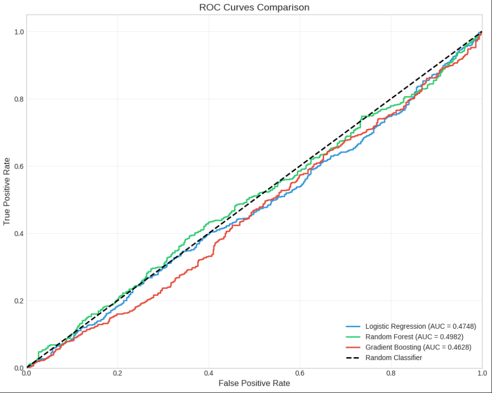

# 📊 Customer Churn Classification

## 📌 Description
This project predicts whether a customer will churn or not using machine learning.

## ✨ Features
- Data preprocessing
- Model training
- Prediction of churn
- Performance comparison

## 🛠️ Technologies Used
- Python
- Pandas
- NumPy
- Scikit-learn

## 📸 Screenshot

